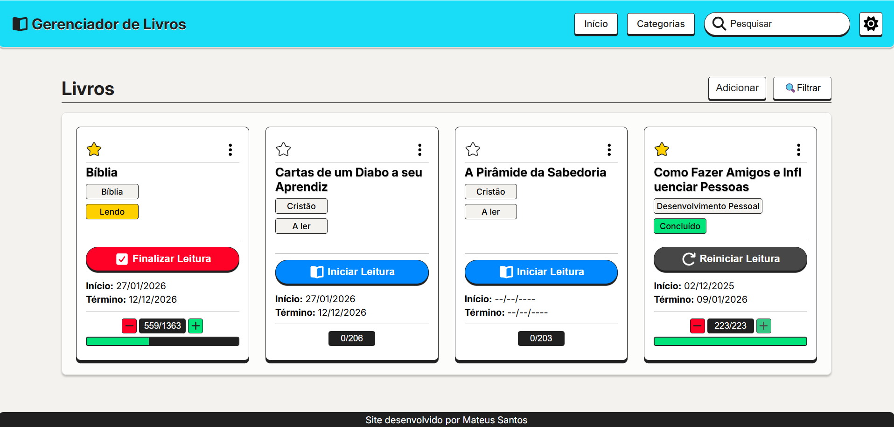

<h1 align="center">📚 Gerenciador de Livros 📚</h1>

<div style="border: 1px solid #ccc; display: inline-block;">
  
</div>

## ℹ️ Sobre

Este projeto é uma **aplicação web desenvolvida em React** para **gerenciamento de livros e acompanhamento de leitura**.
O objetivo foi criar uma solução completa para organizar livros por **categorias**, **status de leitura**, **favoritos** e **progresso**, aplicando boas práticas do **ecossistema React**, como arquitetura por features, Context API, hooks personalizados e otimizações de performance.

O projeto foi desenvolvido com foco em **organização de código**, **escala**, **reutilização de componentes** e **controle eficiente de re-renderizações**.

#### 📍 Acesse o link: https://gerenciador-livros-mts.vercel.app/

---

## 📋 Funcionalidades

### 📖 Gerenciamento de livros

- **Criação de livros**, informando:

  - Nome
  - Categoria
  - Total de páginas
  - Páginas lidas
  - Status de leitura (`to_read`, `reading`, `completed`)
  - Livro favorito

- **Listagem de livros:**

  - Exibição em cards
  - Atualização dinâmica conforme filtros e busca

- **Edição de livros:**
  Livros cadastrados podem ser editados via modal.

- **Exclusão de livros:**
  Remoção de livros já cadastrados.

- **Acompanhamento de leitura:**

  - Controle de páginas lidas
  - Atualização visual do progresso
  - Alteração automática de status conforme o progresso

---

### 🔍 Filtros e busca

- **Filtro por status:**

  - Todos
  - Lendo
  - Não lidos
  - Lidos
  - Favoritos

- **Filtro por categoria**

- **Busca por nome do livro**

  - Sincronizada com a URL via `useSearchParams`
  - Atualização com debounce para melhor performance

- **Ordenação inteligente:**

  - Livros com status **`reading`** priorizados no topo da lista
  - Favoritos priorizados visualmente

---

### 🗂️ Gerenciamento de categorias

- Criação de categorias
- Listagem de categorias
- Edição de categorias
- Remoção de categorias
- Associação de categorias aos livros

---

## 🛠️ Requisitos Técnicos

- **Validação básica de formulários**
- **Responsividade:** layout adaptado para diferentes tamanhos de tela
- **Estado global centralizado** com Context API
- **Controle de performance:** uso consciente de memoização
- **Sincronização de estado com URL**
- **Dados persistentes e sincronizados via localStorage**

---

## 🧠 Arquitetura e Padrões Utilizados

- **Arquitetura baseada em features:**
  Organização por domínio (`books` e `categories`), facilitando manutenção e escalabilidade.

- **Componentização reutilizável:**
  Componentes compartilhados centralizados em `shared/components`
  (Button, Modal, ContainerUI, Forms, HeaderSection, ItemMenu, etc.)

- **Separação de responsabilidades:**

  - Lógica de negócio isolada em **hooks personalizados**
  - Estado global encapsulado em **Context Providers**
  - Tipagens centralizadas em **types**

- **Otimização de renderizações:**

  - `React.memo` para componentes de lista
  - `useMemo` para filtros e ordenações
  - `useCallback` para handlers

- **CSS Modules:**
  Estilos escopados por componente, evitando conflitos globais.

---

## ⚛️ Hooks e Recursos do React

### Hooks nativos

- `useState` — estado local
- `useEffect` — efeitos colaterais
- `useMemo` — valores computados (filtros, ordenações)
- `useCallback` — memoização de funções
- `useContext` — consumo de estado global

### Hooks personalizados

- `useBooks` — gerenciamento completo de livros (CRUD, regras de negócio)
- `useCategory` — controle de categorias
- `useModal` — controle reutilizável de modais
- `useTheme` — gerenciamento de tema da aplicação

---

## 🌐 Gerenciamento de Estado Global

- **Context API** utilizada para:

  - Livros
  - Categorias
  - Tema

- Providers desacoplados para evitar re-renderizações desnecessárias
- Redução de **prop drilling**
- Uso de estado local apenas quando o escopo é restrito ao componente

---

## 🧭 Roteamento e Navegação

- **React Router DOM**
- Separação clara entre:

  - **Páginas** (`pages`)
  - **Features**
  - **Componentes compartilhados**

- Uso de `useSearchParams` para:

  - Busca por livros
  - Sincronização de filtros com a URL

---

## 📁 Estrutura de Pastas

```text
src
 ┣ features
 ┃ ┣ books
 ┃ ┗ categories
 ┣ hooks
 ┣ providers
 ┣ pages
 ┃ ┣ Books
 ┃ ┗ Categories
 ┣ shared
 ┃ ┣ components
 ┃ ┗ layout
 ┣ types
 ┣ utils
```

---

## 🚀 Tecnologias Utilizadas

- **React** (Hooks, Context API, React Router)
- **TypeScript**
- **CSS Modules**
- **date-fns**
- **Vite**

---

## 📄 Licença

Este projeto está sob a licença **MIT**.
Consulte o arquivo `LICENSE` para mais informações.
